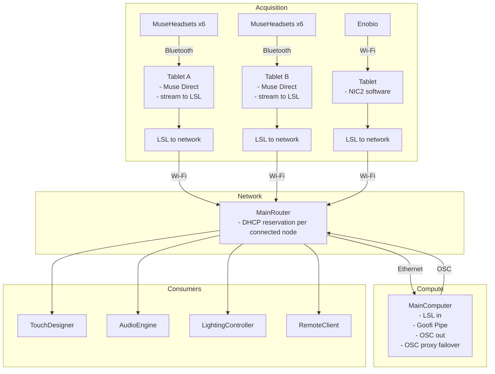

# NeuroTheater

Toolkit for NeuroTheater EEG workflows, centered on **multi-head Muse -> LSL -> goofi-pipe -> OSC routing with failover** for live experimentation. Offline XDF tooling is kept as a legacy appendix.

## Repository layout


| Path                                                 | Purpose                                                                                                                      |
| ---------------------------------------------------- | ---------------------------------------------------------------------------------------------------------------------------- |
| `neuro-theater-eeg/`                                 | EEG toolkit root; legacy XDF exploration code now lives in `examples/exploration/`                                             |
| `neuro-theater-eeg/goofi-files/`                     | Active **goofi-pipe** graph variants for Muse Direct / LSL routing and OSC output                                             |
| `neuro-theater-eeg/osc-io/`                          | OSC proxy failover, recording/replay tools, and operational routing utilities                                                 |
| `neuro-theater-eeg/examples/`                        | Utility demos (including legacy XDF → CSV helpers)                                                                            |
| `neuro-theater-eeg/scripts/patch_muselsl_asyncio.sh` | Optional **muselsl** patch for **Python 3.10+** (Bleak / asyncio)                                                            |
| `neuro-theater-eeg/scripts/muse_stream_resilient.sh` | **Side note:** quick helper to run **muselsl stream** with retries, `nickname.json` lookup, and Conda activation (see below) |
| `neuro-theater-eeg/run_env_neurtheater.sh`           | Helper to `source` and activate a Conda env named `**NeuroTheater`** (adjust if you use another name)                        |


There is no separate `docs/` folder in this tree yet; acquisition notes (Muse, muselsl, goofi-pipe, LSL) are summarized below so you do not need a second markdown file for the same story.

---

## Experimentation architecture (current focus)

The live installation path we are prioritizing is:



- Each MuseHeadsets x6 group connects over Bluetooth to its own tablet.
- Each Muse tablet runs Muse Direct, streams to LSL, and has its own LSL-to-network handoff.
- Enobio follows a parallel acquisition path: Wi-Fi to a tablet running NIC2 software, then LSL to the network.
- Tablet traffic reaches the main router over Wi-Fi.
- The main router links by Ethernet to the main motherboard computer.
- The main computer runs Goofi Pipe, OSC out, and OSC proxy failover; **OSC is sent back onto the LAN via the router** so every downstream consumer can subscribe on the same network.
- **DHCP reservations** are configured on the router for **each node that joins this network** (tablet, main computer, and consumer machines), so addresses stay stable across reboots and sessions.

---

## Legacy appendix: XDF and offline export utilities

- `**XdfExplorer**` (`exploration.xdf_explorer`): loads an XDF via **pyxdf**, lists streams, summarizes channels and shapes, and filters **Muse** streams by LSL name `"Muse"`.
- `**to_csv`**: exports selected streams to **wide** CSV (one row per raw sample; channel columns). With `**output="single"`** the table is **sparse** (one stream’s cells filled per row). With `**output="per_stream"`** each file is dense (numeric channel columns `0`, `1`, …). Optional filters: `**sources**` (LSL `source_id` or stream `name`) and `**types**` (e.g. `EEG`, `GYRO`, `ACC`, `PPG`).
- `**examples/xdf_explorer_demo.py**`: notebook-style cells for exploring a file and trying export options.
- `**examples/convert_xdf.py**`: minimal command-line entry point so someone can convert a recording without editing Python by hand.

Recording from hardware is **outside** this package: you use **LSL** (and tools like **goofi-pipe** / **muselsl**) to produce `.xdf`; this repo helps **after** you have that file.

---

## Requirements

- **Python 3.10+**
- Core package dependency: **pyxdf**
- Optional extras in `pyproject.toml`:
  - `osc`: **python-osc** (`osc-io/osc_recorder.py`, `osc-io/osc_replay.py`)
  - `pyplot`: **pylsl** + **matplotlib** (LSL/live plotting flows)
  - `examples`: **numpy** + **pandas** + **plotly** (example analysis scripts)
  - `audio`: **pydub** (audio-related utilities)

---

## Install the package

From the machine that has the repo:

```bash
cd neuro-theater-eeg
python -m venv .venv
source .venv/bin/activate   # Windows: .venv\Scripts\activate
```

### Install by feature (recommended)

Use one of these depending on what you want to run:

```bash
# Core package only (XDF inspection / CSV export)
pip install -e .
```

```bash
# OSC recorder + replay tools in osc-io/
pip install -e ".[osc]"
```

```bash
# Live LSL + matplotlib helpers
pip install -e ".[pyplot]"
```

```bash
# Example notebooks/scripts using numpy/pandas/plotly
pip install -e ".[examples]"
```

```bash
# Audio utilities
pip install -e ".[audio]"
```

```bash
# Everything optional in one env
pip install -e ".[osc,pyplot,examples,audio]"
```

### Dependencies only (no editable package install)

```bash
cd neuro-theater-eeg
pip install -r requirements.txt
```

The XDF helpers are legacy exploration utilities under `examples/exploration/` and are imported as `exploration` by the example scripts. `**examples/convert_xdf.py**` and `**examples/xdf_explorer_demo.py**` add the local `examples/` folder to `sys.path` so you can run them directly from the `neuro-theater-eeg` repo root.

---

<a id="conda-goofi-env"></a>

## Conda environment + local goofi-pipe (same environment)

Use this when you want **one Conda env** for both this repo and a **local editable** [goofi-pipe](https://github.com/dav0dea/goofi-pipe) checkout (graphs, `LSLClient`, etc.).

**Why pin `pyxdf`:** [goofi-pipe](https://github.com/dav0dea/goofi-pipe) depends on **`numpy<2`**. Recent **pyxdf** releases (**1.17.0+**) declare **`numpy>=2.0.2`**, so `pip` will either warn or upgrade NumPy and break goofi (and packages like **biotuner**). Installing **`pyxdf>=1.16.0,<1.17`** keeps a **NumPy 1.x** stack compatible with goofi while still satisfying this package’s `pyxdf>=1.16.0` requirement.

Default Conda env name in `**run_env_neurtheater.sh**` is **`neurotheater`**. Override with `**NTA_CONDA_ENV=…**` if you use another name.

### Steps

1. **Activate the environment** (must be sourced, not executed as `./…`):

   ```bash
   source /path/to/neuro-theater-eeg/run_env_neurtheater.sh
   ```

2. **(Optional) Reset a broken env** — only if NumPy 2 / wrong pyxdf was already installed:

   ```bash
   pip uninstall -y pyxdf numpy goofi biotuner 2>/dev/null || true
   pip install "numpy>=1.26,<2"
   ```

3. **Install goofi-pipe (editable):**

   ```bash
   export GOOFI=/path/to/goofi-pipe
   pip install -e "$GOOFI"
   ```

4. **Pin pyxdf to the 1.16 line** (before or after neuro-theater-eeg; re-run after `pip install -e .` if pip upgrades pyxdf):

   ```bash
   pip install "pyxdf>=1.16.0,<1.17"
   ```

5. **Install this repo (editable):**

   ```bash
   export NTEEG=/path/to/neuro-theater-eeg
   pip install -e "$NTEEG"
   ```

   If a dependency step bumps NumPy or pyxdf again, re-apply:

   ```bash
   pip install "numpy>=1.26,<2" "pyxdf>=1.16.0,<1.17"
   ```

6. **Verify:**

   ```bash
   python -c "import numpy; print('numpy', numpy.__version__)"
   pip show pyxdf numpy | grep -E '^Name:|^Version:'
   python -c "import goofi; import pyxdf; import sys; sys.path.insert(0, 'examples'); import exploration; print('imports ok')"
   ```

   You want **NumPy 1.26.x** (or any **1.x**), **pyxdf 1.16.x**, and successful imports.

7. **(Optional)** Freeze for reproducibility:

   ```bash
   pip freeze > neurotheater-goofi-lock.txt
   ```

**Rule of thumb:** install **goofi-pipe** first → **cap `pyxdf<1.17`** → **`pip install -e` neuro-theater-eeg** → if anything upgrades NumPy or pyxdf, run step 4 (or the re-apply line in step 5) again.

---

## Legacy appendix: get started with XDF -> CSV

### Option A — One command (good for a file you receive separately)

Put your `.xdf` anywhere, then from `neuro-theater-eeg` with the env active:

```bash
python examples/convert_xdf.py /path/to/recording.xdf -o ./csv_out
```

Defaults write **one CSV per stream** (`per_stream`). Useful flags:

- `--types EEG GYRO` — only those LSL stream types.
- `--single combined.csv` — one sparse wide file instead of per-stream files.

Run `python examples/convert_xdf.py --help` for the full list.

### Option B — Tiny script you paste and execute

Use this pattern after `pip install -e .`:

```python
from pathlib import Path
from exploration import XdfExplorer

XDF_PATH = Path("/path/to/your_recording.xdf")
OUT = Path("csv_out") / "export.csv"
OUT.parent.mkdir(parents=True, exist_ok=True)

xdf = XdfExplorer(XDF_PATH)
xdf.to_csv(OUT, output="per_stream")
print("Wrote:", OUT.parent.resolve())
```

Adjust `to_csv(...)` using the same options as in `examples/xdf_explorer_demo.py` (comments in that file list common combinations).

### Option C — Interactive exploration

Open `neuro-theater-eeg/examples/xdf_explorer_demo.py`, set `XDF_PATH`, then run cells or the whole file to print stream summaries and experiment with `to_csv()`.

---

## Acquisition reference (live stack)

This package does **not** stream from the Muse by itself. A typical path is:

1. **muselsl** (or another LSL source) publishes streams; Muse streams often use the LSL name `**Muse`** and distinct `**source_id**` values per headset.
2. `goofi-pipe` instances consume those LSL streams and publish OSC to the local routing layer (`proxy_in` / `proxy_out` pattern documented below).
3. If you need offline analysis, recordings can still be captured with [Lab Recorder](https://github.com/labstreaminglayer/App-LabRecorder) and exported later with `**XdfExplorer**` / `**convert_xdf.py**` (legacy appendix above).

If you use **muselsl** on **Python 3.10+** and hit asyncio / Bleak issues, see `**neuro-theater-eeg/scripts/patch_muselsl_asyncio.sh`** (re-run after upgrading muselsl in that environment).

To activate a Conda environment consistently, `**source neuro-theater-eeg/run_env_neurtheater.sh**` (must be sourced, not executed as a normal subprocess, so the activation sticks). Override the env name with `NTA_CONDA_ENV` if needed.

`**scripts/muse_stream_resilient.sh**` is a small, **unofficial** convenience on top of that stack: it sources `**run_env_neurtheater.sh`**, resolves a headset **MAC** from `**nickname.json`** (by nickname or `hardware_sticker`, or you pass the full UUID), runs `**muselsl stream**` with default `**--ppg --acc --gyro**` (override tail after `--`), and restarts when the process exits or logs a disconnect. Flags `**-n` / `--max-retries**` and `**-i` / `--interval**` cap backoff behavior. After `**muselsl**` starts, it prints discovered **LSL** outlets to **stderr** (lines prefixed `**[muse_stream_resilient][lsl]`**): stream `**name**`, `**type**` (EEG / ACC / GYRO / PPG / …), `**source_id**` (maps to Goofi `**source_name**`), channel count, and rate. That needs `**pylsl**` and a working `**liblsl**` in the same environment; if `**pylsl**` is missing, listing is skipped with a one-line message. Set `**NTA_LSL_DISCOVER=0**` to disable listing (e.g. automation). Optional naming toggle: `**--name-with-type**` (or `**NTA_MUSE_NAME_WITH_TYPE=1**`) patches the launch so outlets are published as names like `**Muse_EEG**`, `**Muse_GYRO**`, `**Muse_ACC**`; this helps Goofi flows that only match `**source_name` + `stream_name**`, but it intentionally breaks compatibility with tools that expect stream name exactly `**Muse**`. For a manual second terminal without coupling to this script, run `**examples/lsl_stream_picker.py**`. Treat the script as a **quick-and-dirty** way to keep a stream up while you **experiment with geoscope data** and related LSL paths—not a supported product surface of this package. Run `**bash scripts/muse_stream_resilient.sh --help`** from `**neuro-theater-eeg**` for usage.

---

## Four-head live procedure (current)

This is the setup we are actively using right now for 4 headsets.

1. Run one Goofi graph per headset, all sending OSC to `proxy_in` on `:8001` with per-head prefixes (example: `/1D1A/*`, `/1E58/*`, `/22FC/*`, `/2615/*`).
2. Start proxy failover from `osc-io/`:

   ```bash
   python osc_proxy_failover.py --in-port 8001 --out-port 8000 --recording recordings/osc_recording_2026-04-21_18-51-39.json
   ```

3. Proxy listens for live data on `0.0.0.0:8001`, detects stale per OSC address, crossfades to recording fallback, then crossfades back when live changes again.
4. Downstream nodes (TouchDesigner/collaborators) read from `proxy_out` on `:8000` (UDP mode, not multicast, unless you intentionally run multicast).

That is the whole chain: `Goofi (4 heads) -> Proxy failover -> OSC consumers`.

---

## OSC throughput notes (capacity + scaling)

Current observed OSC profile (local tests):

- Single-headset-ish baseline: `**~220 messages/sec**`.
- Multi-headset baseline: `**~1,590 messages/sec**` aggregate.
- Typical per-headset load in multi-headset mode: `**~410 messages/sec**`.
- Typical stream shape per headset: `**~15 streams @ ~27.4 Hz**`.

Capacity math to keep in mind:

- `messages/sec (total) ≈ headsets × streams_per_headset × stream_frequency`
- `bandwidth ≈ messages/sec × bytes_per_packet`

What moves the needle fastest:

- More streams (`S↑`) = linear load increase.
- Higher stream frequency (`F↑`) = linear load increase.
- Bigger payloads (`B↑`) mostly increase bandwidth, less packet-rate pressure.

Operational rule of thumb for this setup:

- `**<10 headsets**`: usually comfortable.
- `**10-20 headsets**`: monitor packet loss and jitter.
- `**20+ headsets**`: expect network + receiver tuning work.
- `**30+ headsets**`: expect architecture work.

---

## XDF helper surface

```python
from exploration import XdfExplorer

xdf = XdfExplorer("recording.xdf")
len(xdf)                    # number of streams
xdf.stream_summary()        # list of dicts: name, type, source_id, channel_count, series_shape
xdf.muse_streams()          # streams whose LSL name is exactly "Muse"
xdf.to_csv("out.csv", ...)  # see docstring on XdfExplorer.to_csv
```

---

## Version

Package version **1.0.0** (see `neuro-theater-eeg/pyproject.toml`).

@author: @franckPrts